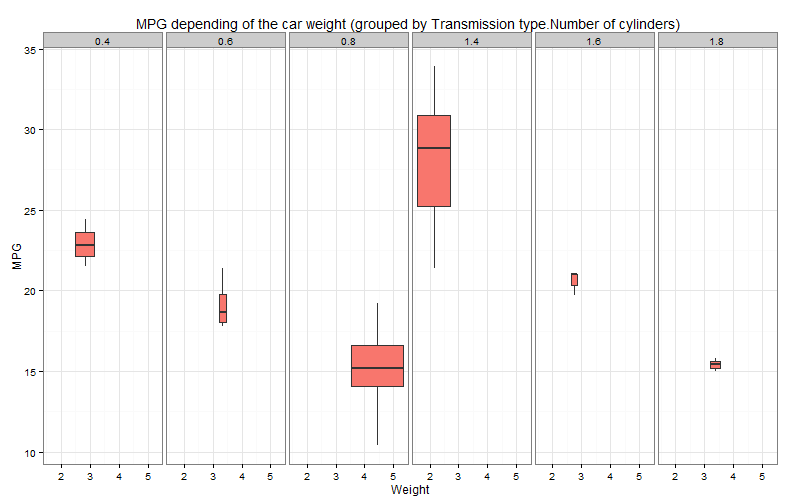

---
title       : Estimator for MPG
subtitle    : Application for calculating the estimated miles per gallon
author      : Lena Stevanoska
job         : 
framework   : io2012   # {io2012, html5slides, shower, dzslides, ...}
highlighter : highlight.js  # {highlight.js, prettify, highlight}
hitheme     : solarized_light      # 
widgets     : [mathjax]            # {mathjax, quiz, bootstrap}
mode        : selfcontained # {standalone, draft}
knit        : slidify::knit2slides
--- bg:snow

## Why "Estimator for MPG"?


1. Let's you know what you can expect from your car
2. Just 3 simple parameters required
3. Intuitive interface

---  bg:snow

## Scientific support

Estimated value is calculated using the following formula

 $Y = \hat \beta_0 + \hat \beta_1 * X_1 + \hat \beta_2 * X_2 + \hat \beta_3 * X_3$

The $\hat \beta_k$ values are calculated using the linear regression model fitted through the mtcars dataset.


```
##               Estimate Std. Error    t value     Pr(>|t|)
## (Intercept) 39.4179334  2.6414573 14.9227979 7.424998e-15
## factor(am)1  0.1764932  1.3044515  0.1353007 8.933421e-01
## wt          -3.1251422  0.9108827 -3.4308942 1.885894e-03
## cyl         -1.5102457  0.4222792 -3.5764148 1.291605e-03
```
The $X_k$ values are the entered values:
* $X_1$ = Transmission type (0 = Automatic, 1 = Manual)
* $X_2$ = Weight (in $lb/1000$)
* $X_3$ = Number of cylinders (4, 6, 8)


---bg:snow


## The data used to create the prediction model





---bg:snow

## Estimator MPG - Live demo

<iframe src='https://lsdev.shinyapps.io/EstimateMPGApp' height='600px'></iframe>
